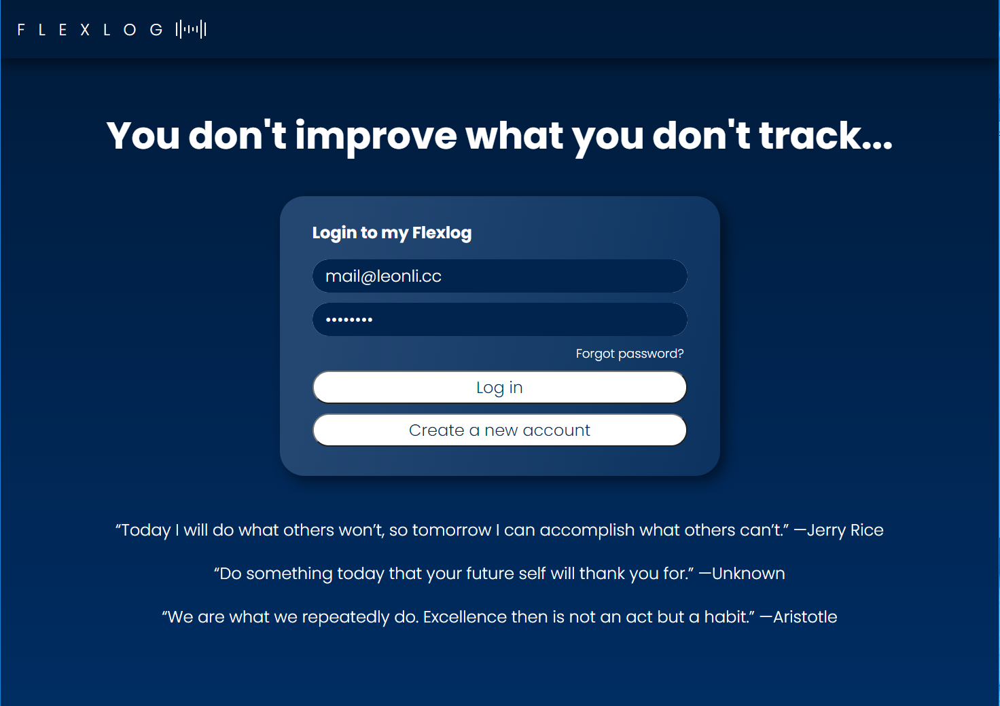
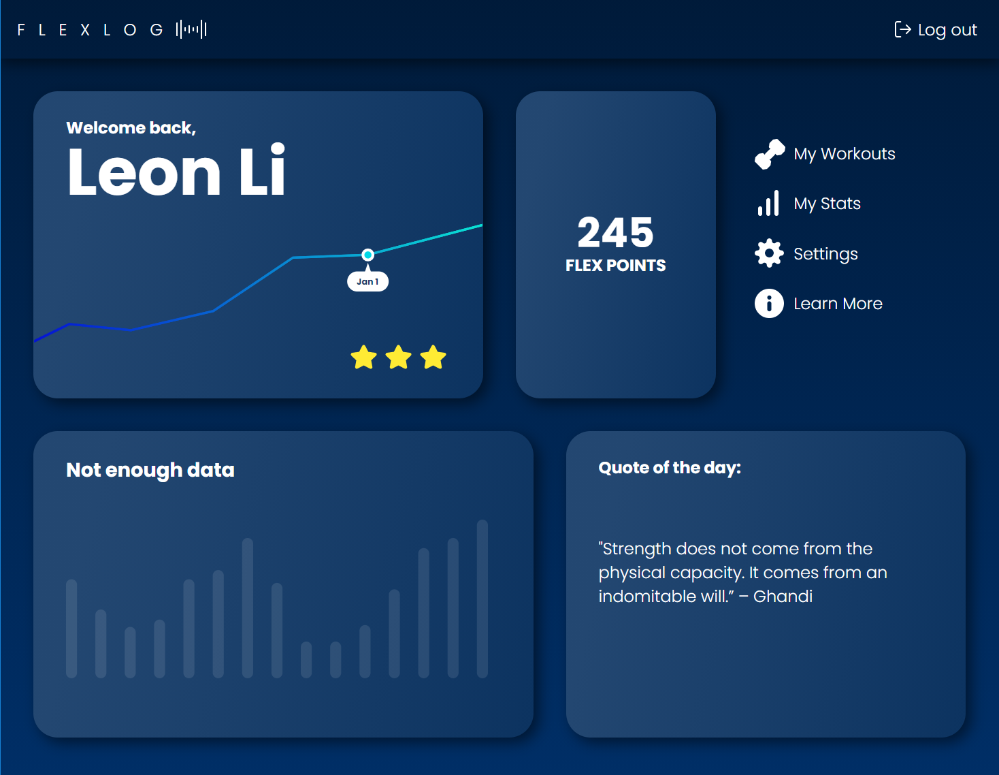
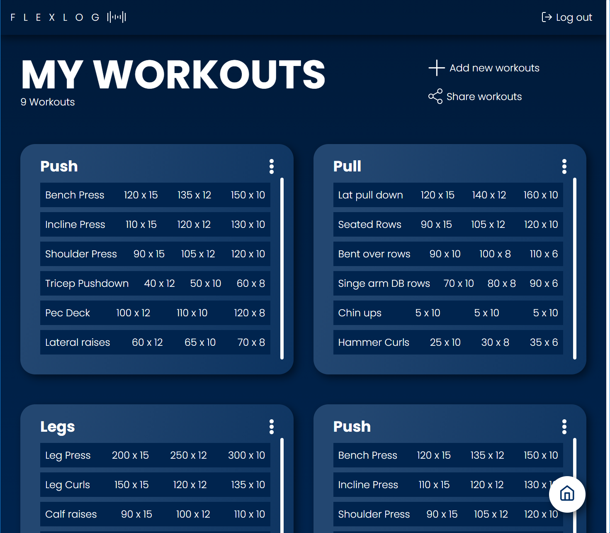

# Flexlog

A fitness tracking and sharing web app built with the MERN stack and Next.js
Features authentication and authorization using JSON Web Tokens for a secure and improved user experience.
Check it out on Vercel [here](https://flexlog.vercel.app)

